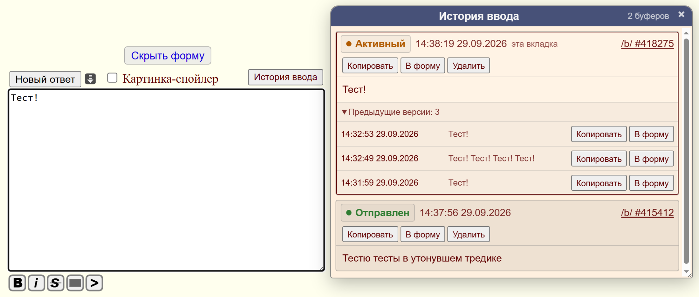

# Dobrochan Draft History

Небольшой userscript для Tampermonkey, добавляющий локальную историю черновиков к форме постинга Dobrochan.

### [Установить userscript](https://drizzle-mizzle.github.io/dobrochan-drafts-history/)

Требуется Tampermonkey. Скрипт работает на `rf.dobrochan.net/vichan/*` и рассчитан на совместную работу с Dollchan.

## Что умеет скрипт

- Сохраняет вводимый текст и историю его изменений, в том числе при закрытии страницы или браузера.
- Хранит отдельный буфер для каждой формы ввода, может работать с несколькими вкладками одновременно.
- Показывает общую историю черновиков из разных тредов в отдельном плавающем окне.
- После перезапуска страницы или браузера автоматически восстанавливает незаконченный черновик.

## Установка

1. Установите расширение **Tampermonkey** в браузер.
2. Нажмите ссылку **«Установить userscript»** вверху этой страницы.
3. Tampermonkey откроет страницу установки скрипта.
4. Подтвердите установку.
5. Откройте или перезагрузите страницу Dobrochan.

После установки рядом с элементами формы постинга появится кнопка **«История ввода»**. Окно истории можно держать открытым рядом с формой и перемещать мышью.

## Как работает

Скрипт сохраняет черновики в локальном хранилище Tampermonkey. Вместе с текстом записываются номер доски и треда, технический идентификатор буфера и время изменения. История никуда отдельно не отправляется.

У каждой вкладки и каждого активного буфера есть собственный идентификатор. Если браузер был закрыт с незавершённым сообщением, при следующем запуске скрипт ищет подходящий активный буфер того же треда и, если его удаётся однозначно сопоставить с формой, подставляет текст обратно.

Если сопоставление не удалось, запись не удаляется, а получает статус **«Брошен»** и остаётся доступной через историю. После успешной отправки собственный пост определяется по поведению Dollchan и помечается как **«Отправлен»**. Завершённые записи автоматически очищаются примерно через 180 дней, активные автоматически не удаляются.

## Совместимость и ограничения

- Скрипт ориентирован на текущую форму Vichan на `rf.dobrochan.net`.
- Поддерживается перемещение, скрытие и плавающий режим формы Dollchan.
- Определение успешной отправки опирается на поведение Dollchan и класс собственных постов `.de-mypost`.
- Если структура сайта или Dollchan существенно изменится, userscript может потребовать обновления.
